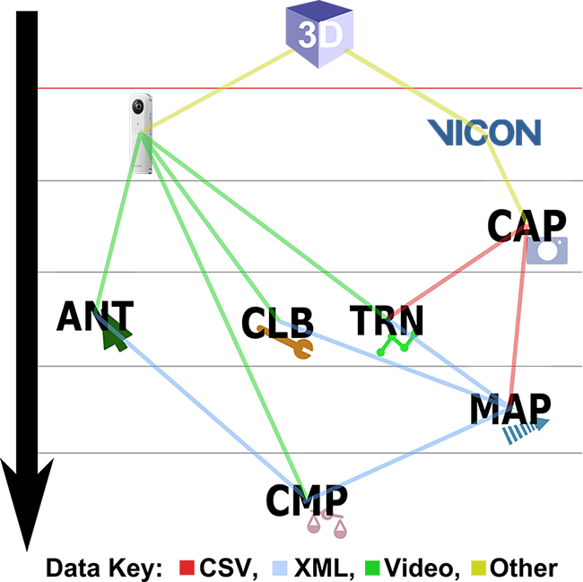
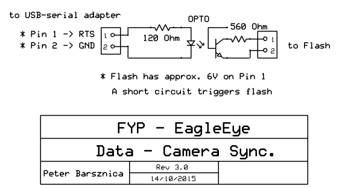

Eagle Eye Project
=================

1 Overview
----------
Verifying the accuracy of tracking software is a common problem. Current methods
are subjective. Here we present a novel solution to quantify annotations with a 
Vicon Tracking System. This system will provide 'ground truth' data that is 
accurate and comparable.

The project opted to use a Ricoh Theta m15 - a omnidirectional camera with two lenses.
This proves difficult with the images presenting very large 'fisheye' distortions.
Here we attempt a few methods of calibration to resolve these distortions.

Gathering ground truth data from Vicon is strikingly complex. First interfaces
must be made to the system to gather raw data. Then the pose of the camera - in 
relation to the Vicon data - must be determined. Then the data can be mapped to
a 2D image plane to compare with the annotations created by the tracking software.

The project aims to provde a proof-of-concept Annotation tool, with which to compare
against the captured ground truth data. This a multi-object, omnidirectional tool,
providing quite a challege.

To accompany the process, tools and research; the project collected ~40 example
datasets of varying complexity to validate the concept and to be used by the wider 
research community.


### 1.1 Team
__ITMS__

- Gwilyn Saunders
- Kin Kuen Liu
- Manjung Kim

__Engineering__

- Peter Barsznica

__Supervisors__

- Victor Stamatescu
- Russell Brinkworth


### 1.2 Legal
-   The all-scientific CRAP License
-   <http://matt.might.net/articles/crapl/CRAPL-LICENSE.txt>


### 1.3 Prerequisites
Please ensure all software dependencies are the same architecture
(32 or 64-bit). The PyVicon library is built for a 32-bit Vicon Tracking System.
So unless you want to be recompiling it (you don't), stick to 32-bit.

- Windows 7+
- Python 2.7 (Anaconda or scipy)
- PyQt 4.10 (Qt 4.8.7)
- OpenCV 3.0
- Numpy 1.9.3
- Matplotlib 1.4.3
- *For Capture*
  - Vicon Tracker System (v1.2 32-bit)
  - Serial RS232 Serial connection
  - [Flash Sync circuit](3-1-4-flash-sync-circuit)
  - A camera flash w/ PC-SYNC connection


### 1.4 Install instructions

Download and install the pre-requisities:
- [Anaconda](https://repo.continuum.io/miniconda/Miniconda-latest-Windows-x86.exe)
- [OpenCV](http://sourceforge.net/projects/opencvlibrary/files/opencv-win/3.0.0/opencv-3.0.0.exe/download)

__opencv-ffmpeg and cv2.pyd__

- Go to the extracted opencv folder -> build -> python -> 2.7 -> x86
  - copy cv2.pyd into into the python27 -> Lib -> site-packages folder.
- Go to the extracted opencv folder -> sources -> 3rdparty -> ffmpeg 
  - copy opencv_ffmpeg.dll into the python27 folder.

__Note about Miniconda__

The linked installer is a smaller version of Anaconda called Miniconda. This
doesn't include some dependencies of the EagleEye project. To install them, open
a terminal and run `$ conda install <package>`.

Require packages are:
- numpy (tested with 1.9.2)
- matplotlib (tested with 1.4.3)
- pyqt (tested with 4.10)


#### 1.4.1 Re-compiling PyVicon
You really shouldn't need to do this unless you're not using a different 
Vicon Tracker than the one at the UniSA Mawson Lakes campus. Mawson lakes runs
Tracker (Rigid bodies) v1.2 32bit. 

__Visual Studio versions__

To recompile, the system needs to have Visual Studio installed. The python 
setuptools only read the `VS90COMNTOOLS` environment variable, some tweaking is 
required if that is not your VS version.

- No SET required (for VS2008)
- `SET VS90COMNTOOLS=%VS100COMNTOOLS%` (for VS2010)
- `SET VS90COMNTOOLS=%VS110COMNTOOLS%` (for VS2012)
- `SET VS90COMNTOOLS=%VS120COMNTOOLS%` (for VS2013)

__Vicon DataStream SDK__

Download the Vicon DataStream SDK from [here](http://www.vicon.com/products/software/datastream-sdk).
If this doesn't match your Vicon installation, find the right one with Google or
hope that your installation includes the SDK.
Copy all of the SDK files into the `python_vicon` folder.

__Compiling__

- ensure setuptools is installed with `$ conda install setuptools`
- open a terminal in the `python_vicon` directory
- run these: (supposedly they help?)

     ```sh
        SET MSSDK=1
        SET DISTUTILS_USE_SDK=1
    ```
- execute the setup.py `$ python setup.py build`
- check for errors in the output (good luck)
- open the new `build` folder, look for a `lib.win32` or `lib.win-amd64`
- copy the `pyvicon.pyd` back into the root `python_vicon` folder


2 Pipeline Overview
-------------------


This describes the overall process (top-to-bottom). Objects are recorded by two
methods; camera and Vicon. The camera data is processed by the annotation tool 
while the mapping methods collect calibrations and convert the Vicon data into
2D data. The two datasets are then compared in a final tool and evaulated.


3 Core Tools
------------

### 3.1 Vicon Capture


This tool records object positional data into [CSV files](#5-1-raw-dataset-csv) 
from the Vicon system. It includes quality verification and time synchronisation data.

__Preparation__

The Vicon system captures objects that are defined as unique "constellations"
of infared reflectors (approx 9mm diameter) placed on physical objects within 
the lab. These objects are configured in the *Vicon Tracker* software. Some 
experimental/working objects are stored in the [data/objects](data/objects) folder.

Ensure your running time is sufficient, modify via the command line option or
within the [config file](#6-1-capture). 

Ensure the correct serial port is defined in the config file.
A list of available serial ports can be found with this command:
``` sh
$ python -m serial.tools.list_ports
```

__Procedure__

The camera must not be moved between the calibration and capture steps. Thankfully, 
the Ricoh Theta m15 can be remotely triggered via a smart phone or tablet running
Android or iOS.

The tool will capture all active objects in the *Vicon Tracker* software. Be sure to
only enable the objects for a given scenario.

1. Ensure all preparations steps are completed
2. Prepare the camera for recording
3. Run the software (either by GUI or command line)
4. After the first flash, start the camera recording
5. The flash will trigger again, now start perform the scenario
6. The last flash will signal the end of the dataset
7. Stop the camera recording
8. Check the output folder that the objects are all recorded

__Command line Usage__

```sh
$ python vicon_capture.py {-output <folder> | -time <in minutes> | -config <file> | -training <file>}
```

#### 3.1.1 Flash Sync Circuit
This is a circuit by design of Peter Barsznica that triggers a camera flash when
signalled from a serial connection to the computer. This matches the flash data
fields in the CSV file in order to syncronise the video and data feeds.

__This is the circuit detail__



__The circuit connects to the serial GND and CTS pins__


#### 3.1.2 Synchronisation
When running the software, the flash will trigger 3 times. This is a uncorrectable
side-effect of the hardware, therefore the software will delay a number of frames
(as specified in the [config file](#6-1-capture)) before the first flash is triggered.
There are still only 2 flashes recorded into the CSV.


### 3.2 Calibration


A Camera Calibration Tool based on the OpenCV Library. This script detects 
chessboard pattern from a set of images and determines the intrinsic and distortion
parameters of the camera lens. It can highlight the grid intersections of a
chessboard-like pattern, providing an estimated error and sample rectified images.

__Preparation__

First collect a set of chessboard images, taken by the camera, in varying positions 
around the lens. For the best calibration; be sure the whole pattern is visible in 
each image and that the images cover majority of the lens.

__Procedure__

- Use VLC or the (Extract Tool)[4-2-chessboard-extractor] to gather images from the camera video
- Run the calibration tool with all of the images in the args. (`dualcalib.py images\*.jpg`)

__Command line Usage__

```sh
$ python dualcalib.py -output <file path> <multiple jpg files> {-chess_size <pattern: def. 9,6> | -square_size <in mm: def. 1.0> | -preview <preview file folder> | -config <file>}
```

__Note__

A variant script `stdcalib.py` is available for calibrating single lens cameras.


### 3.3 Trainer


This tool creates a training set for the Mapping tool using the Vicon Wand 
3D positional data and corresponding video capture. This is used to calculate the
extrinsic parameters of the camera, and therefore its pose within the room.

__Procedure__

- Ensure marks are first specified or use the marker tool to find  them
- Use the 1 and 2 keys to switch between the lenses
- Track through the video (left and right keys) until a suitable point is visible
- Click on a point to mark it
- Track back a single frame to review the mark
- Repeat until _at least_ 4 points are trained. Recommended 20+ points.
- Press enter to save the settings, ESC to discard

__Command line Usage__

```sh
$ python trainer.py <video file> <csv file> <data out file> {<mark_in> <mark_out> | -clicks <num_clicks> | -config <file>}
```


### 3.4 Mapping


This software applies mapping routines to convert 3D raw data into 2D datasets 
using models from the Training and Calibration tools.

__Command line Usage__

```sh
$ python mapping.py -calib <calib xml> -trainer <trainer xml> -output <output dataset> [<multiple csv files>] {--config <file>}
```


### 3.5 Annotation


Takes raw camera footage or images from the Ricoh Theta and applies automated 
object detection algorithms. Includes manual adjustment of the annotations.
Outputs an annotated video or image, depending on the input as well as an XML
Dataset - of identical format to the Mapping Tool.

__Preparation__

1. You need to prepare an initial video file to annotate.
2. To use automatic annotation, you need to use the semi-automatic tool first to input a xml file.
3. Using the marker tool, you need to get the mark_in and mark_out frame numbers, then pass the values into the command line argument.
Otherwise, it will record entire data into the xml, from beginning of the video to end of the video.
The mark_in and mark_out values indicate where to add. It adds the frame between mark_in + 1 frame, and mark_out frame into the XML.

__Procedure__

1. Run the annotation tool. (python annotation.py) No need to type mark_in and mark_out at this moment.
2. Click "Open semi-automatic tool" button from the main GUI.
3. Click "Split frames from video" button and select the initial video file from the preparation 1.
4. Select the folder to store frames, it will take 1-2 minutes to output frames from the video.
5. Click "Import image frames" button and select the folder from step 4 above.
6. Semi-automatically annotate the object by drawing rectangles. The index of object will be stacked, starting from 1.
Click "draw" button to draw rectangle, and Click "draw" button to drag existing rectangle.
Click "undo" button to undo drawing, and Click "redo" button to redo drawing.
7. Click "Next" button until the object moves, and if you think the object is out from the previous rectangle, repeat step6.
(Usually you should repeat step6 per 15 frames, but if object doesnt move, you dont need to do.)
(Or if the movement of object is huge, for example if object was "buttonside" at previous frame and moved to "backside" in current frame, repeat step6.)
8. Click "Update XML File" button to save the semi-automatic results into a XML file, specify location to save.
9. Run the annotation tool again with the full command line argument. ($ python annotation.py -mark_in <markinframe number> -mark_out <markoutframe number>)
10. Click "Automatic annotation" button from the main GUI.
11. It will say "Please select file". Just Click "Ok" button 
12. It will pop-up a file dialog named as "Please select your video file". Select your initial video file from the preparation 1 and click open button.
13. It will pop-up a file dialog named as "Please select your XML file if possible". Select your input xml file from the step 8 and click open button.
14. It will pop-up a file dialog named as "Please select output filename to save the file". Specify your output video file name, check location and click save button.
15. Click "OK" button to start automatic annotation, the annotation time depends on the size of video, but usually it takes 1-2 minutes.
16. Once the annotation has been completed, it will pop-up a message, just click "OK" button.
17. It will pop-up a file dialog named as "Please write output xml filename to save the dataset". Specify your output xml file name, check location and click save button.
The output xml file from above will be used in the comparision tool.
18. Check the output video file to see how annotation works.
19. If you are not happy with the performance of output video file, you can re-use the semi-automatic tool from step 2. 
20. You can either update the "input" xml file from step 8, or "output" xml file from step 17. (However, updating output xml file from step17 doesnt improve automatic annotation.)
21. In case of updating "input" xml file, from step8, will improve the performance of automatic annotation. Go back to step 2 and do step5.
Click "Import XML File" button and open the xml file from step 8. Review-the output annotated video, and go to the frame which was not happy for you.
Manually specify the objects again, and once you finish that, click "Update XML File" button, it will overwrite the imported XML file.
Do step 9 again, and use the updated "input" XML File.
22. In case of updating "output" xml file, from step8, the xml file will be used in another button called "Annotation from XML".
This case does not improve the performance of automatic annotation, because the button does not contain automatic annotation.
It just converts the XML file to the video.
This case is for only when step 21 does not work properly.
Click "Import XML File" button and open the xml file from step 17. Review-the output annotated video, and go to the frame which was not happy for you.
Manually specify the objects again, and once you finish that, click "Update XML File" button, it will overwrite the imported XML file.
Do step 9 again, and use the updated "output" XML File.

__Command line Usage__

```sh
$ python annotation.py -mark_in <markinframe number> -mark_out <markoutframe number>
```


### 3.6 Evaluation


This tool provides frame-by-frame comparison between the mapped centroid (ground-truth)
and the annotated centroid. Each comparison is determined by the object name and the side
of lens it is in. The difference is calculated in [Euclidean Distance] (http://docs.opencv.org/3.0-beta/modules/core/doc/operations_on_arrays.html?highlight=cv2.norm#norm)
with NORM.L2. At the end the script, the frame-by-frame comparison can be toggled to plot
for each object in the dataset (produced by matplotlib).

__Preparation__

1. Annotated XML file
2. Mapped XML file
3. Ensure Annotated XML file has correct target labels specified

__Procedure__

1. Add the mapped xml in dataset_mapped.xml field in wizard tool
2. Add the annotated xml in dataset_annotated.xml field in wizard tool 
3. Optional output format can be specified as either xml or csv in `eagleyeeye.cfg` [Evaluation Config](#6-7-evaluation)
4. Decide whether you want to visualise and plot a frame-by-frame comparison graph for each of the robots in the dataset at the end of script, also see [Evaluation Config](#6-7-evaluation)
5. Select a path to export the file to (Either by pressing evaluation.xml field or step 6)
6. Ensure the path has correct output format as specified in step 3
7. Run Evaluation

__Command line Usage__

```sh
$ python eval.py <annotated dataset> <mapped dataset> <output file> {-config <file>}
```


4 Utility Tools
---------------
These are additional tools, that although are not project critical, but certainly 
make the whole process easier.

### 4.1 Wizard
This is a Graphical User Interface that implements the core tools in an 
easy-to-follow layout. It is intended to appear like the 
(dataflow diagram)[2-pipeline-overview] in order to visualise the overall process.

__Usage__

```sh
$ python wizard.py
```

Or generate a new shortcut with `gen_shortcut.bat`. This will produce a 
_EagleEye Wizard_ file. Double click the shortcut.

Be sure to re-generate the shortcut if you move the project folder.


### 4.2 Chessboard Extractor
Tracks through a video file and extracts selected images to a folder. The user
navigates through the video and can tag the frames they wish to use.

__Command line Usage__

```sh
$ python extract_frames.py <video file> <output image folder> {-prefix <output name> | -config <file>}
```


### 4.3 Trainer Comparison
This tool is to verify the accuracy of a given extrinsic training. As the user
tracks through the video, the tool will compare each training point against 
the corresponding mapped point. This produces an error measurement.

__Command line Usage__

```sh
$ python compare_trainer.py <video file> <mapper xml> <trainer xml> {<mark_in> <mark_out> | -config <file> | -export <file>}
```


### 4.4 Dataset Comparison
This tool is somewhat similar to the trainer comparison tool. Where this tool
pits two datasets against each other to visualise the difference. Please note that
this tool does not perform (evaluation)[#3-6-evaluation].

__Command line Usage__

```sh
$ python compare.py <video file> <xml dataset> <xml dataset> {<mark_in> <mark_out> | -config <file> | -export <file>}
```


5 Data Formats
--------------
The following section outlines the structure of the output files produced by our tools.
Output file format includes .csv, .xml.
Data dictionaries describing the output data is also laid out.


### 5.1 Raw Dataset CSV
This is object data represented in the Vicon World Coordinates. Each file
contains data for a single object captured. Containing positional, rotational,
sychronisation and marker data.

| Column | Data        | Type  | Examples |
|--------|-------------|-------|----------|
| 0      | Timestamp   | float | 0.144    |
| 1      | Sync        | char  | F, .     |
| 2      | X-axis      | float | 5121.54  |
| 3      | Y-axis      | float | 1543.33  |
| 4      | Z-axis      | float | 45.1431  |
| 5      | X-rotate    | float | 0.1123   |
| 6      | Y-rotate    | float | 0.2323   |
| 7      | Z-rotate    | float | 2.1102   |
| 8      | Max Markers | int   | 5        |
| 9      | Visible     | int   | 4        |


__Synchronisation__

-   . (dot) - is a regular frame
-   F - is a flash frame, there should only be 2 of these within a dataset

__Rotation__

The rotational X, Y, Z is a
[Euler Vector](https://en.wikipedia.org/wiki/Axis%E2%80%93angle_representation),
not to be mistaken with Euler Angles - pitch, yaw, roll.


### 5.2 Calibration XML
This contains the camera intrinsic values and distortion coefficients. It contains
intrinsics for both lenses. It also contains some error metrics, although these
aren't explicitly used in any tool.

``` xml
<?xml version='1.0'?>
<dual_intrinsic>
    <Buttonside>
        <CamMat cx="488.175326627" cy="478.94638883" fx="254.127305966" fy="255.484172972" />
        <DistCoe c1="0.0" c2="0.0" c3="0.0" c4="0.0" k1="-0.0171416537233" k2="0.00124838013824" k3="3.84782779449e-05" k4="0.116735621147" k5="-0.00502050693142" k6="0.000317011928086" p1="-0.000477421902718" p2="-0.000143055577271" />
        <Error arth="0.290929432817" rms="2.36849146329" total="10.4734595814" />
    </Buttonside>
    <Backside>
        <CamMat cx="459.480698678" cy="489.757300849" fx="241.644695381" fy="241.812653001" />
        <DistCoe c1="0.0" c2="0.0" c3="0.0" c4="0.0" k1="0.00987461484022" k2="0.000247414863475" k3="8.26584785527e-06" k4="0.144976371435" k5="-0.00296523619781" k6="9.90414253597e-05" p1="0.00017787766362" p2="5.07307005624e-05" />
        <Error arth="0.322888672819" rms="2.53764413382" total="7.10355080202" />
    </Backside>
</dual_intrinsic>
```

### 5.3 Trainer XML
This represents the extrinsic values in their most raw form. To calcuate a useable
extrinsic, these training values are combined with the intrinsic values. The data 
is a set of point pairs. These are the same position represented in two different 
dimensions, 2D and 3D. These points are run through a solver in order to determine
a single translation and rotation vector - know as the extrinsic paramters. 
This XML contains extrinsics for both lenses.

``` xml
<?xml version='1.0'?>
<TrainingSet>
    <video file="wand_right.avi" />
    <csv file="2015-08-27_13-24_Wand.csv" />
    <Buttonside points="1">
        <frame num="46">
            <plane x="252" y="567" />
            <vicon x="6604.76905818057" y="1225.0367491552" z="71.7138299051588" />
        </frame>
    </Buttonside>
    <Backside points="1">
        <frame num="101">
            <plane x="453" y="673" />
            <vicon x="6259.08569084885" y="1905.83353105066" z="69.601629741746" />
        </frame>
    </Backside>
</TrainingSet>
```

### 5.4 Dataset XML
- Frame number indicates the frame numbers from the video.
- Object name indicates name of object and it depends on its id. 
- The id is defined by the index of object, the index of object starts from 01 and it is defined from the semi-automatic annotation tool.
- The lens is defined by the side of the object. If an object has x coordinate which has bigger than half of width of frame, then its buttonside.
- If an object has x coordinate which has smaller than half of width of frame, then its backside.
- In the Boxinfo attribute, it contains x,y coordinates and width height of the bounding box.
- In the centroid attribute, it contains x,y 2D coordinates which is a centroid point from the bounding box.
- Datasets produced by the Mapping tool can include a `<Visiblilty>` tag in each object, which contains whether Vicon has successfully tracked this object. This is useful for the evaluation tool.

``` xml
<?xml version='1.0'?>
<dataset>
    <frameInformation>
        <frame number="1" />
        <object name="EE1" lens="Backside" id="01">
            <boxinfo y="488" x="499" width="63" height="74"/>
            <centroid y="525" x="530"/>
            <visibility visible="5" visibleMax="5"/>
        </object>
        <object name="EE2" lens="Buttonside" id="02">
            <boxinfo y="406" x="1465" width="83" height="104"/>
            <centroid y="458" x="1506"/>
            <visibility visible="5" visibleMax="5"/>
        </object>
    </frameInformation>
</dataset>
```

### 5.5 Evaluation XML
- Frame number indicates the frame numbers from the video.
- Mapper indicates the file name of the mapped XML
- Annotation indicates the file name of annotated XML
- The mean value of differences in this set in pixels
- Frames contains all the compared frames
- Frames compared shows the number of compared frames
- Frames total is the total number of frames in the video
- Frame contains all compared objects compared within the frame
- Object name is the ID being used to distinguish objects
- Object lens dictates the side (buttonside or backside) that this object is visible in
- Object err is the euclidean distance difference between annoatated centroid and mapped centroid

``` xml
<?xml version='1.0'?>
<AnnotationEvaluation>
	<video mark_in="34" mark_out="360" />
	<mapper>set14_mapped.xml</mapper>
	<annotation>set14_mapped.xml</annotation>
	<comparison mean_err="0.0" />
	<frames compared="325" total="325">
		<frame num="35">
			<object err="0.0" lens="Buttonside" name="EE5">
				<annotatedCentroid x="884" y="533" />
				<mappedCentroid x="884" y="533" />
			</object>
			<object err="0.0" lens="Backside" name="EE4">
				<annotatedCentroid x="1190" y="632" />
				<mappedCentroid x="1190" y="632" />
			</object>
		</frame>
		.
		..
		...
	</frames>
</AnnotationEvaluation>
```


### 5.6 Evaluation CSV
This is an optional output format [Evaluation Tool](#3-6-Evaluation) produces.

| Column | Data                         | Type      | Examples  |
|--------|------------------------------|-----------|-----------|
| 0      | Frame Number                 | int       | 35        |
| 1      | Mapped Centroid (x)          | int       | 453       |
| 2      | Mapped Centroid (y)          | int       | 842       |
| 3      | Annotated Centroid (x)       | int       | 450       |
| 4      | Annotated Centroid (x)       | int       | 840       |
| 5      | Lens                         | string    | Buttonside   |
| 6      | Euclidean Distance           | float     | 0.2323    |


### 5.7 Header XML
This is metadata XML file. It contains file paths and information about a 
dataset when saved via the [Wizard Tool](#4-1-wizard). It allows a zipped
datasets to saved and loaded at will.

``` xml
<?xml version='1.0'?>
<datasetHeader date="2015-08-27" name="August27">
    <description>August 27 test set. Single lens, single target.</description>
    <calibration>
        <xml>calibration.xml</xml>
        <chessboards path="chessboards/" size="4">
            <file>Backside_10.jpg</file>
            <file>Backside_11.jpg</file>
            <file>Backside_12.jpg</file>
            <file>Backside_14.jpg</file>
        </chessboards>
    </calibration>
    <training>
        <xml>training.xml</xml>
        <video mark_in="28" mark_out="667">wand_right.avi</video>
        <csv>2015-08-27_13-24_Wand.csv</csv>
        <map>training_map.xml</map>
    </training>
    <rawData>
        <video mark_in="32" mark_out="721">august27_right.avi</video>
        <vicon path="vicondata/" size="1">
            <file>2015-08-27_13-27_EE1.csv</file>
        </vicon>
    </rawData>
    <datasets>
        <mapping>dataset_mapping.xml</mapping>
        <annotation>dataset_annotation.xml</annotation>
    </datasets>
    <evaluation>august27-evaluation.xml</evaluation>
    <comparison>august27-compare.avi</comparison>
</datasetHeader>
```


6 Configuration
---------------
Each tool reads a config file `eagleyeeye.cfg` to allow various configurations to be customised in code executions.
These are parameters that users may change to suit their needs in functions such as colour representation, quality control, output format etc.

### 6.1 Capture
| Setting           | Description                                               | Default       |
|-------------------|-----------------------------------------------------------|---------------|
| ip_address        | The address of the Vicon Tracker software (typically local)      | 192.168.10.1   |
| port              | The port of the tracker software                          | 801            |
| date_format       | Formatting with which to timestamp output files           | Y-%m-%d\_%H-%M |
| flash_delay       | How long (in frames) to wait before beginnning the set    | 180            |
| framerate         | How often the tracker is to be polled (per second)        | 44.955         |
| default_time      | How long to run the capture (in seconds)                  | 180            |
| default_output    | Where the data is stored                                  | data/raw       |
| output_delimiter  | The CSV delimiter                                         | ,              |
| serial_device     | The serial adapter port name                              | COM4           |
| run_serial        | Whether to activate the flash                             | True           |
| trainer_target    | Which target to look for when training                    | EEWand         |

### 6.2 Trainer
| Setting           | Description                                           | Default       |
|-------------------|-------------------------------------------------------|---------------|
| buffer_size       | Video buffer size in frames                           | 50            | 
| default_clicks    | Number of maximum clicks                              | 9999          |
| dot_colour        | Colour of clicked points (B, G, R)                    | (255,255,255) |
| min_reflectors    | Minimum of visible reflectors (requires at least 4 to be accurate)                                      | 4              | 
| check_negatives   | Check for negative positional data (happens when VICON loses track of the object)                       | True           | 
| ignore_baddata    | Prevent user from click and saving bad training points as specified in min_reflectors & check_negatives | True           | 
| dual_mode         | Calibrate dual lenses in one video (see 3.3 Trainer for usage) | True           | 

### 6.3 Mapper
| Setting           | Description                                           | Default       |
|-------------------|-------------------------------------------------------|---------------|
| trainer_target    | Name of the trainer target being used                 | EEWand        | 
| camera_fov        | Field of View angle of the camera (dual lens mode only) | 180           | 
| pnp_flags         | OpenCV [solvePnP flags] (http://docs.opencv.org/3.0-beta/modules/calib3d/doc/camera_calibration_and_3d_reconstruction.html#solvepnp) | |

### 6.4 Calibration
| Setting           | Description                                           | Default       |
|-------------------|-------------------------------------------------------|---------------|
| default_squares   | Size of a square in chessboard pattern (millimeters)  | 1.0           | 
| default_chess     | Number of intersecting corners of inner squares (rows, columns), see 3.2 Calibration for illustration | (9,6)          | 
| calib_flags       | OpenCV [calib3d flags] (http://docs.opencv.org/3.0-beta/modules/calib3d/doc/camera_calibration_and_3d_reconstruction.html#calibratecamera) (Unfinished work) | |

### 6.5 Compare
| Setting           | Description                                           | Default       |
|-------------------|-------------------------------------------------------|---------------|
| buffer_size       | Video buffer size in frames                           | 50            | 
| xml1_colour       | Colour representing mapped centroid (ground-truth) (B, G, R)    | (255,255,255) |
| xml2_colour       | Colour representing annotated centroid (B, G, R)                | (255,255,255) |
| fourcc            | Codec package name (must support .avi .mp4 etc.)      | DIVX          | 

### 6.6 Compare Trainer
| Setting           | Description                                           | Default       |
|-------------------|-------------------------------------------------------|---------------|
| buffer_size       | Video buffer size in frames                           | 50            |
| trainer_colour    | Colour representing user-clicked training points (B, G, R) | (0,255,0)|
| mapper_colour     | Colour representing reprojected trainer centroid (B, G, R) | (255,255,255)      |
| trainer_target    | Name of the trainer target being used (Always EEWand) | EEWand        | 
| fourcc            | Codec package name (must support .avi .mp4 etc.)      | DIVX          | 
| min_reflectors    | Minimum of visible reflectors (requires at least 4 to be accurate)    | 4              | 
| ignore_baddata    | Prevent user from click and saving bad training points as specified in min_reflectors & check_negatives | True           | 
| offset            | How many frames to advance                            | 2              |
| offset_mode       | Which frame step to use (mov or csv)                  | mov            |

### 6.7 Evaluation Tool
| Setting           | Description                                           | Default       |
|-------------------|-------------------------------------------------------|---------------|
| outputformat      | File extension of output compariosn (xml or csv only) | csv           |
| plot              | Whether to plot frame-by-frame centroid comparison graphs at end of script | True          |

### 6.8 Chessboard Extractor
| Setting           | Description                                           | Default       |
|-------------------|-------------------------------------------------------|---------------|
| buffer_size       | Video buffer size in frames                           | 50            |

### 6.9 Fonts
| Setting           | Description                                           | Default       |
|-------------------|-------------------------------------------------------|---------------|
| font_scale        | OpenCV font scale                                     | 0.4           |
| font_thick        | OpenCV font thickness                                 | 1             |
| font_colour       | OpenCV font colour (B, G, R)                          | (255,255,255) |
| font_family       | OpenCV [font type] (http://docs.opencv.org/3.0-beta/modules/imgproc/doc/drawing_functions.html#initfont) | FONT_HERSHEY_SIMPLEX  |
